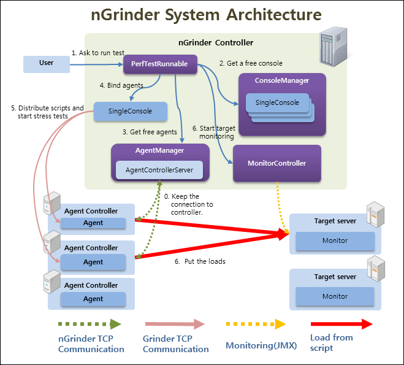

# Beanstalk을 활용한 스케일링 가능한 Ngrinder 환경 구축하기

네이버의 [Ngrinder](https://github.com/naver/ngrinder)는 대표적인 성능 부하 테스트 도구입니다.  
개인적으로는 다른 테스트 도구들에 비해서 설치 과정이 조금 번거롭다는 단점에 비해 사용성과 UI/UX가 너무 직관적이라는 장점으로 인해서 오랫동안 애정하고 있는 제품인데요.

* [서버 퍼포먼스 테스트 툴 사용후기](https://tech.madup.com/performance_test_tool/)

설치형을 지원하다보니 **동적으로 Agent 수를 늘리고싶을때**마다 설치된 이미지로 서버를 재생성하는 방식으로 늘리는게 참 불편했습니다.  
이럴 경우 AWS를 통해서는 보통 2가지 방법으로 해결할 수 있는데,

* 오토스케일링 그룹
* Beanstalk

등 동적으로 동일한 서버 환경을 편하게 증설할 수 있습니다.  
  
이번 시간에는 AWS Beanstalk을 이용하여 스케일링 가능한 Ngrinder 환경 구축하기를 진행해보겠습니다.

## 1. EC2에 Controller 설치하기

가장 먼저 Ngrinder의 Agent를 관리하고, 성능 테스트 전체를 관리하는 Controller를 EC2에 설치해보겠습니다.



Ngrinder의 release 페이지를 가보시면 현재 사용 가능한 버전들을 볼 수 있는데요.

* [Ngrinder release](https://github.com/naver/ngrinder/releases)

현재 3.5.5가 최신이니, 3.5.5 버전을 다운 받아 보겠습니다.  


```bash
wget https://github.com/naver/ngrinder/releases/download/ngrinder-3.5.5-20210430/ngrinder-controller-3.5.5.war
```

```bash
mv ngrinder-controller-3.5.5.war ngrinder-controller.war
```

```bash
nohup java -jar ngrinder-controller.war >/dev/null 2>&1 &
```


```bash
ps -ef | grep java
```

```bash
ec2-user  2601  2528 21 15:06 pts/0    00:00:00 java -jar ngrinder-controller.war
ec2-user  2614  2528  0 15:06 pts/0    00:00:00 grep --color=auto java
```


## 2. Security Group 생성

**NGRINDER_AGENT**


**NGRINDER_CONTROLLER**


* `80` 포트는 `wget`을 통해 controller에서 agent 설치 파일을 다운 받기 위해 추가합니다.

그리고 이렇게 만들어진 보안 그룹은 

## 3. Beanstalk에 Agent 설치하기


### Beanstalk config

```bash

📦 ngrinder-in-action
├─ .ebextensions
│  ├─ 01-appstart.config
│  ├─ 02-system-tuning.config
│  └─ 03-timezone.config
├─ .gitignore
├─ .platform
│  └─ nginx
│     └─ nginx.conf
├─ Procfile
├─ deploy.sh
├─ README.md
```

**.ebextensions/01-appstart.config**

```bash
files:
    "/sbin/appstart" :
        mode: "000755"
        owner: webapp
        group: webapp
        content: |
            #!/usr/bin/env bash
            COLLECTOR="collector ip"
            AGENT_FILE_HOST="agent download link"
            wget ${AGENT_FILE_HOST} -P /var/app/current
            tar -xvf /var/app/current/ngrinder-agent-*.tar

            killall java
            /var/app/current/ngrinder-agent/run_agent.sh -ch ${COLLECTOR}
```

**.ebextensions/02-system-tuning.config**

```bash
files:
  "/etc/security/limits.conf":
    content: |
      *           soft    nofile          65535
      *           hard    nofile          65535

commands:
  01:
    command: "echo \"10240 65535\" > /proc/sys/net/ipv4/ip_local_port_range"
  02:
    command: "sysctl -w \"net.ipv4.tcp_timestamps=1\""
  03:
    command: "sysctl -w \"net.ipv4.tcp_tw_reuse=1\""
  04:
    command: "echo \"net.ipv4.tcp_max_tw_buckets=2000000\" >> /etc/sysctl.conf"
  10:
    command: "sysctl -p"
```

**.ebextensions/03-timezone.config**

```bash
commands:
  01remove_local:
    command: "rm -rf /etc/localtime"
  02link_seoul_zone:
    command: "ln -s /usr/share/zoneinfo/Asia/Seoul /etc/localtime"
```


**.platform/nginx/nginx.conf**

```bash
user                    nginx;
error_log               /var/log/nginx/error.log warn;
pid                     /var/run/nginx.pid;
worker_processes        auto;
worker_rlimit_nofile    65535;

events {
    use epoll;
    worker_connections  1024;
}

http {
  include       /etc/nginx/mime.types;
  default_type  application/octet-stream;

  log_format  main  '$remote_addr - $remote_user [$time_local] "$request" '
                    '$status $body_bytes_sent "$http_referer" '
                    '"$http_user_agent" "$http_x_forwarded_for"';

  include       conf.d/*.conf;

  map $http_upgrade $connection_upgrade {
      default     "upgrade";
  }

  server {
        listen        80 default_server;

        # (1) health check
        location / {
            return 200 'ok';
        }

        access_log    /var/log/nginx/access.log main;

        client_header_timeout 60;
        client_body_timeout   60;
        keepalive_timeout     60;
        gzip                  off;
        gzip_comp_level       4;

        # Include the Elastic Beanstalk generated locations
        include conf.d/elasticbeanstalk/healthd.conf;
  }
}
```

(1) `location /`
* Beanstalk의 Load Balancer Health Check 주소가 `/`
* Ngrinder의 Agent가 Health Check 대상이 되기 보다는 Nginx에서 바로 `/`로 200응답을 주게 하여 Health Check를 통과하도록 구성


## 4. 배포하기

**deploy.sh**

```bash
#!/usr/bin/env bash

DIR=deploy

if [ -d "$DIR" ]; then rm -Rf $DIR; fi

mkdir $DIR
cp -r .ebextensions ./deploy/
cp -r .platform ./deploy/
cp -r ngrinder-agent-*.tar ./deploy/
cp -r Procfile ./deploy/
cd deploy
zip -r agent.zip .
mv agent.zip ../
```

> Github Action으로 설정이 변경될때마다 배포하는 방법도 추후 포스팅하겠습니다.